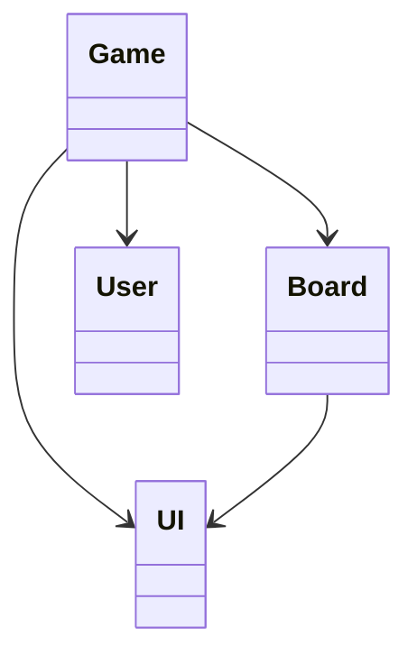
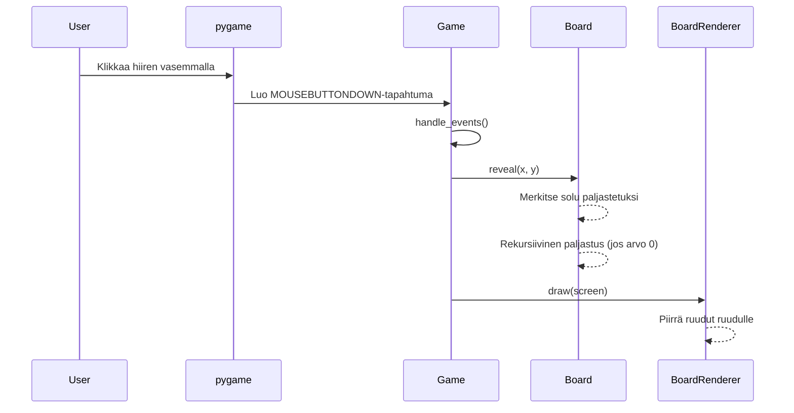

# Luokkakaavio

```mermaid
classDiagram
    class Game 

    class Board 

    class UI

    class User

    Game --> User
    Game --> Board
    Game --> UI
    Board --> UI
```

# Sekvenssikaavio (Vasemman hiirinapin painallus pelikentällä)

```mermaid
sequenceDiagram
    participant User
    participant pygame
    participant Game
    participant Board
    participant BoardRenderer

    User->>pygame: Klikkaa hiiren vasemmalla
    pygame->>Game: Luo MOUSEBUTTONDOWN-tapahtuma
    Game->>Game: handle_events()
    Game->>Board: reveal(x, y)
    Board-->>Board: Merkitse solu paljastetuksi
    Board-->>Board: Rekursiivinen paljastus (jos arvo 0)
    Game->>BoardRenderer: draw(screen)
    BoardRenderer-->>BoardRenderer: Piirrä ruudut ruudulle
```
