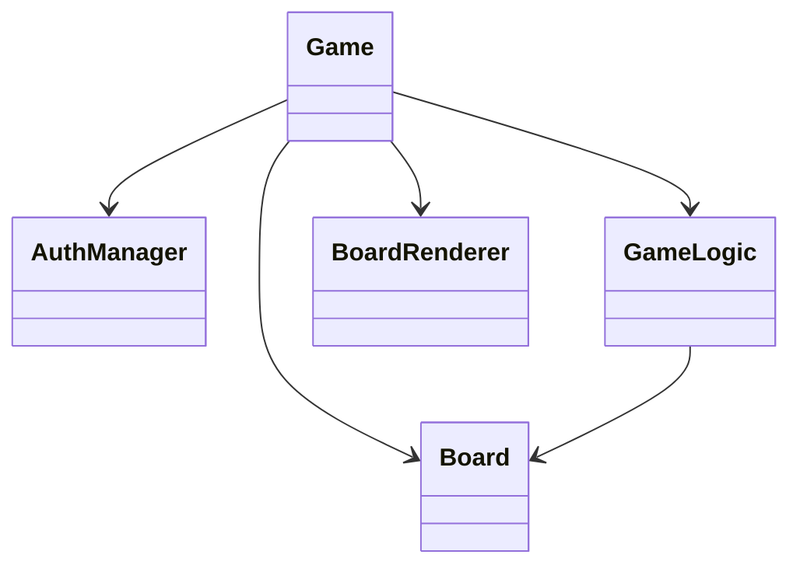
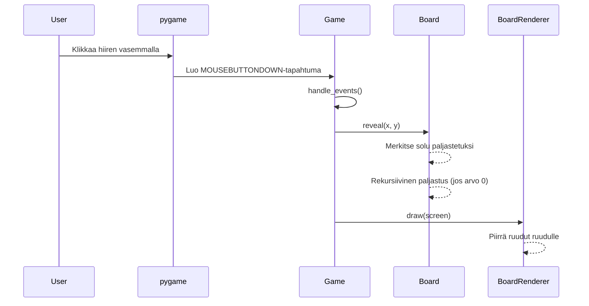

# Arkkitehtuurikuvaus

## Rakenne

Ohjelma on jaettu kahteen alihakemistoon, ui, joka sisältää käyttöliittymää käsitteleviä luokkia (Game, BoardRenderer), ja game, joka sisältää sovelluslogiikkaa käsitteleviä luokkia (Board, Auth, GameLogic).

Alla on kaavio joka sisältää luokat, ja niiden yhteydet.

# Luokkakaavio

# Käyttöliittymä

Käyttöliittymässä on 4 eri näkymää. Kirjautuminen, missä voi rekisteröidä uuden käyttäjän, sekä kirjautua sisään. Tämän jälkeen pääsee valikkoon, missä voi valita pelimuodon kolmesta eri muodosta, pieni, medium ja iso. Tämän jälkeen siirrytään pelilaudalle, jonka koko riippuu valinnasta valikossa. Kun peli on päättynyt, voi halutessaan katsoa viimeaikaisia tuloksia tulosnäkymän avulla.

# Tietokanta

Tietokannassa on kaksi taulua, users ja scores. Users tallentaa rekisteröidyt käyttäjät, ja varmistaa, että kirjautuminen toimii ainoastaan silloin kun käyttäjä on jo olemassa. Scores tallentaa jokaisen pelin tuloksen niin, että omia tuloksia katsoessa ne eivät sekaannu muiden joukkoon, vaan ainoastaan omat tuokset näkyvät tulosnäkymässä.

# Sekvenssikaavio (Vasemman hiirinapin painallus pelikentällä)

